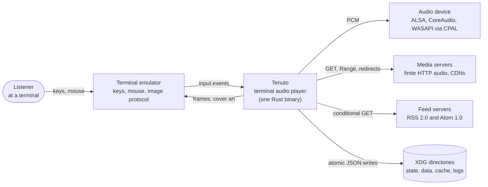
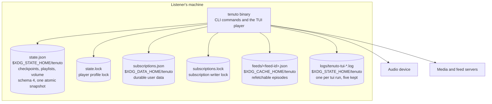
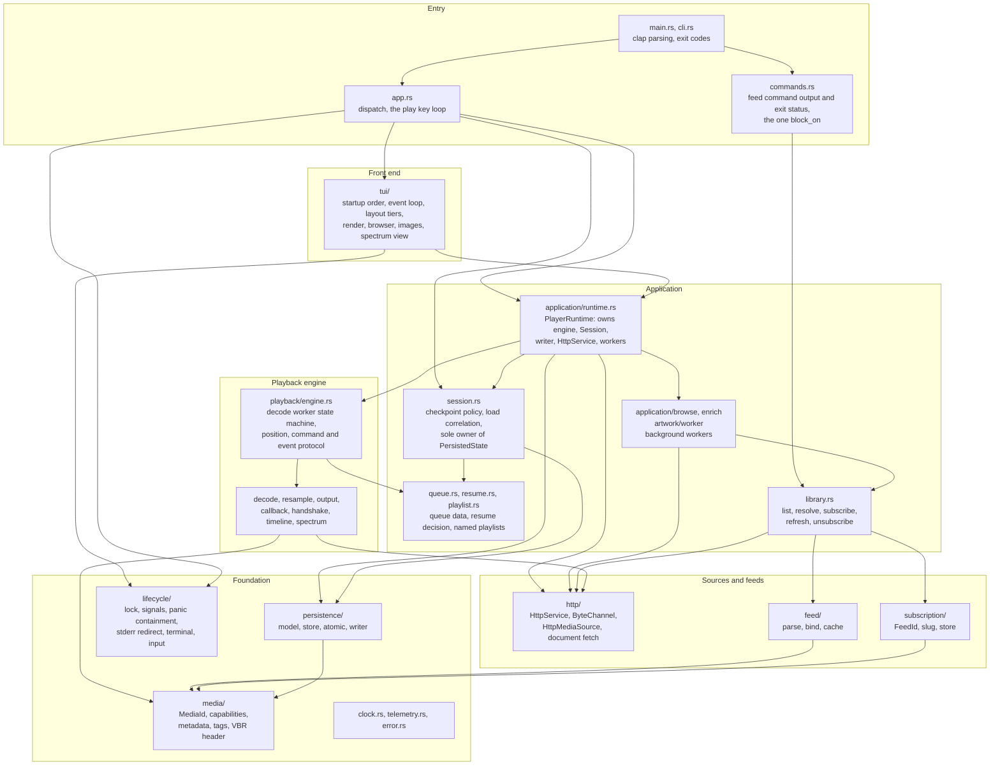
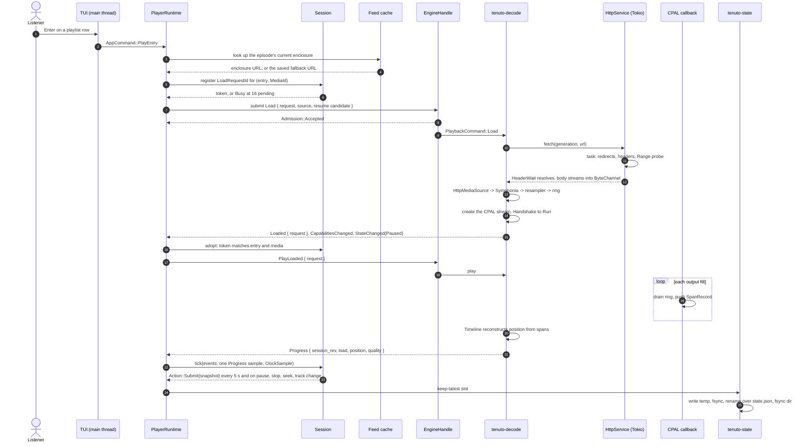
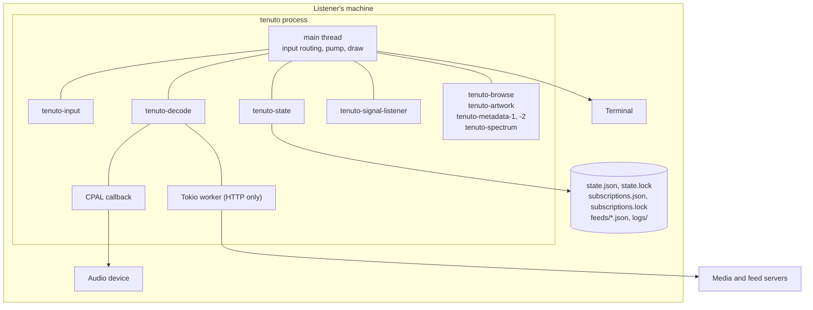

# Tenuto architecture

Tenuto is a keyboard-first terminal audio player for local files, finite remote audio over HTTP, live HTTP radio, and podcast episodes from RSS or Atom feeds. It ships as one Rust binary, `tenuto`, with a plain `play` command and a full-screen `tui` player.

This document describes the system as built through milestone 8. It uses the C4 model: context, containers, components, one runtime sequence, and deployment. The design decisions behind each part live in the specs under [`superpowers/specs/`](superpowers/specs/). The acceptance records live in [`m3-acceptance.md`](m3-acceptance.md), [`m5-acceptance.md`](m5-acceptance.md), [`m6-acceptance.md`](m6-acceptance.md), [`m7-acceptance.md`](m7-acceptance.md), [`m7.1-acceptance.md`](m7.1-acceptance.md) and [`m8-acceptance.md`](m8-acceptance.md). Known debt lives in [`m1-known-debt.md`](m1-known-debt.md).

## 1. Scope and invariants

Transport and media semantics are separate. HTTP does not by itself make media finite, seekable, resumable, or live. A live stream plays as indefinite media: it cannot seek, never completes, and is never checkpointed.

The one invariant every other rule serves:

> Stopping or recreating the audio transport pipeline must not implicitly reset the logical playback position.

The position contract:

> **Position** is the session's logical resume point. It advances from estimated playback of media frames. Stop and transport recreation preserve it. Restoration, media selection, explicit restart, and successful seeks establish a new position.

For indefinite media, position is listening time: audio heard since the load. It survives reconnect, pause and stop, excludes silence, and is never a resume point or a seek target. `capabilities.continuity` says which meaning applies.

A position carries two independent labels:

| Label | Type | Question it answers |
|---|---|---|
| Quality | `PositionQuality` (`Exact`, `Estimated`, `Degraded`) | How precisely is the *heard* position known, given the output callback's timing spans? |
| Provenance | `PositionProvenance` (`Established`, `Estimated`) | Is the *media time* itself decoder-confirmed, or derived from a byte-offset estimate? |

Provenance is sticky. Decoding forward from an estimated landing stays `Estimated` until a confirmed seek, an established restart, or a fresh load re-establishes the absolute position. An estimated position may drive display and resume. It must never replace an established checkpoint for the same media.

Other fixed rules:

- Nothing plays, fetches or refreshes on its own. Every network request follows an explicit user action. Reconnect attempts for a live stream continue a current Play: they are cancellable at once, bounded, and never start or resume after a process restart.
- Feed listings never write files. A corrupt cache is reported and left in place.
- A partial success never exits zero.
- Every URL in a message or a log line has passed `redact_url` first.
- Runtime code forbids `unsafe` and denies `unwrap` and `expect`.
- **A fresh load's starting point is a choice `resume_intent_for` makes per media kind, not a weakening of the position contract above.** Since M8, a local file's or a plain URL's *fresh load* always starts at position zero, whatever checkpoint is on record; a podcast episode still resumes it. The checkpoint is unaffected either way — it is still recorded and still read back — and the position contract still governs everything downstream of that starting point: once loaded, stop, pause and transport recreation continue to preserve it exactly as before. Pausing and pressing Stop then Play is not a fresh load and always continues mid-track.

## 2. System context



Tenuto talks to nothing else. There is no daemon, no client, no remote control, and no third-party service integration.

## 3. Containers

Tenuto is one process. Its containers are the binary and the files it owns.



| File | Owner | Durability | Written by |
|---|---|---|---|
| `state.json` | Player | Durable | The writer thread only, as one atomic snapshot |
| `state.lock` | Player | Never written or unlinked | Locked by `tui` and `play` |
| `subscriptions.json` | Feed layer | Durable user data | `subscribe`, `unsubscribe`, `refresh`, from the CLI or the browser |
| `subscriptions.lock` | Feed layer | Never written or unlinked | Locked by every subscription mutation |
| `feeds/<feed-id>.json` | Feed layer | Disposable, refetchable | `subscribe` and `refresh` |
| `logs/` | TUI | Disposable | The fd-2 redirect under `tui` |

On macOS and Windows the XDG paths resolve to the platform's own data, cache and local-data directories.

## 4. Components

The crate is layered. Higher layers depend on lower ones. The playback engine never learns that persistence exists. `library` returns values and never prints.



| Component | Responsibility | Must not |
|---|---|---|
| `cli`, `main` | Parse arguments. Map outcomes to exit codes. Print the final error. | Contain policy |
| `app` | Resolve a `play` argument into `(MediaId, SourceLocation)`. Run the legacy key loop. Dispatch `tui`. | Decode or persist directly |
| `commands` | Format feed command columns. Decide feed command exit status. Enter the Tokio runtime in one function, `wait_http`. | Decide what to fetch or commit |
| `library` | The application seam for feeds: `list_feeds`, `list_episodes`, `resolve_episode`, `subscribe`, `unsubscribe`, `refresh`, `refresh_all`. Async where the network is involved. | Print, `block_on`, open a device or a terminal |
| `application::runtime` | One owner for the engine, `Session`, the writer, the `HttpService` and the workers. Driven by `AppCommand` values. Pumped once per front-end iteration. | Read a key or draw a frame |
| `session` | Decide what to checkpoint and when. Allocate and track `LoadRequestId` tokens. Build every state snapshot. | Perform I/O or own a thread |
| `queue`, `resume`, `playlist` | Pure data and policy: queue occurrences with stable IDs, the resume decision from a position and a completion flag, and a named, optionally shuffled playlist wrapping a queue. | Import persistence |
| `playback` | The decode worker, the CPAL stream's whole lifecycle, position accounting, the command and event protocol, the spectrum tap and worker. | Depend on persistence or block on Tokio |
| `http` | Produce encoded bytes and the evidence that classifies them. One fetch task per source generation. One capped whole-document fetch per call. | Own a decoder, a resampler or a stream |
| `feed`, `subscription` | Parse a document, bind items to `MediaId::PodcastEpisode`, store the cache and the subscription list. | Touch playback state |
| `persistence` | Read, classify and atomically replace `state.json`. Coalesce writes on one thread. | Merge snapshots |
| `lifecycle` | Profile lock, signal listener, panic containment, fd-2 redirect, terminal cleanup, input thread, test hooks. | Contain business logic |
| `media` | Validating identities, capabilities, metadata, tag and VBR-header reading. | Perform network I/O |
| `tui` | Startup, event loop, teardown, layout tiers, drawing, the browser and its feed management, artwork placement, spectrum bars. | Mutate `PersistedState` except through `Session`; decode, read directories or probe tags inline |

**The playlist model (M8).** A `Playlist` wraps today's `Queue` with an identity, a name and an optional shuffle; `PersistedState` holds a `Vec<Playlist>` in place of the old single queue. Entry IDs and playlist IDs are each their own global, monotonic counter allocated by `PersistedState` — never by a `Queue` or a `Playlist` itself — so an entry ID is unique across every playlist, not just within one. `PersistedState` also remembers which playlist is `playing` and that playlist's cursor (`current_media`); a cursor is adopted, not merely selected, and ownership survives moving between playlists (§9.1). The *viewed* playlist — which tab the front end is looking at — is transient runtime state kept by `application::runtime`, never written to disk.

## 5. Execution contexts

Each thread has strict ownership. The names below are the OS thread names.

| Context | Thread | Owns | Must not |
|---|---|---|---|
| Application | main | Input decoding, `AppCommand` routing, pumping the runtime, drawing, the command sender and the event receiver | Hold a decoder or a CPAL stream. Block on a worker's result |
| Input reader | `tenuto-input` | The crossterm read loop, handed over a bounded channel. Isolates the main loop from a hung-up terminal | Interpret keys |
| Decode worker | `tenuto-decode` | Symphonia demux and decode, resampling, command processing, PCM production, position anchoring, the CPAL stream's full lifecycle | Block on the Tokio runtime |
| CPAL callback | device thread | Drain the bounded SPSC ring, emit silence on underrun, push one `SpanRecord` per fill, write the optional output tap | Lock, allocate, wait, or perform I/O |
| Null output | `tenuto-null-output` | With `TENUTO_AUDIO_OUTPUT=null`: pace the real callback core against a wall clock and discard the samples | Exist in production use |
| State writer | `tenuto-state` | Serialize and atomically write the keep-latest snapshot, coalesced over 2 s | Run on Tokio |
| HTTP runtime | Tokio, one worker | The reqwest client, one fetch task per source generation, one document fetch per call | Touch decoder or device state |
| HTTP source adapter | runs on `tenuto-decode` | `HttpMediaSource`: synchronous, cancellable reads and seeks over `ByteChannel` | Call into Tokio directly |
| Signal listener | `tenuto-signal-listener` | Record the first of SIGINT, SIGHUP, SIGTERM. Set the shutdown flag. Wake the application | Render, load state, or flush |
| Metadata workers | `tenuto-metadata-1`, `-2` | Tag probes for untitled local queue entries, each inside `run_contained` | Touch `Session`, the terminal or the network |
| Artwork worker | `tenuto-artwork` | One latest-wins slot: resolve and decode the active entry's cover within 10 MiB encoded and 16 million pixels, inside `run_contained` | Encode for the terminal or open its own connection |
| Spectrum worker | `tenuto-spectrum` | Read the output taps, run the 2048-sample Hann FFT, publish at most 20 frames per second into a latest-value slot | Block or allocate on the callback's behalf. Catch its own panics |
| Browse worker | `tenuto-browse` | One request at a time: a directory level, the subscription list, one feed's cached episodes, and since M6 the subscribe, refresh and unsubscribe mutations through `library` | Recurse into a library or touch `Session` |

The Tokio runtime exists only when the source is an HTTP URL. A local-file session runs with no Tokio runtime at all.

Only artwork and metadata jobs are contained. `lifecycle::panic::run_contained` sets a thread-local flag around a `catch_unwind`. The panic hook sees the flag, writes one sanitized line to the session log, and the job reports an ordinary failure. Every other panic is fatal. The spectrum worker belongs to the engine and has no containment on purpose.

## 6. Sequence: play a podcast episode from the terminal player

The listener presses Enter on an episode already added to the viewed playlist. The diagram shows the path from the key to the first checkpoint.



Rules the sequence relies on:

- **Correlation.** Every `Load` carries a `LoadRequestId`. `Loaded`, the `Loading` state change, and a load's own `Failed` echo it. `Session` adopts an entry only on a `Loaded` whose token is registered and whose entry still exists with the same media. A late outcome for a removed entry cannot resurrect it. Each accepted load gets exactly one of `Loaded`, `LoadCancelled`, or `Failed { request: Some }`.
- **Order.** The application drains events, then samples `Progress` once. The sample that follows a transition event is strictly newer than the transition. `Session::tick` ignores progress whose token is not the adopted one.
- **No implicit start.** `PlayLoaded` plays only while the worker still owns that token and is paused after a successful open. A failed load never triggers a reopen.
- **No network before play.** Restoring a playlist or adding an episode to one reads the local cache only. The cover art request goes out only after playback has opened a connection.

## 7. Playback engine contracts

### 7.1 Command and event protocol

Two bounded `crossbeam-channel` queues plus a keep-latest `Progress` snapshot connect the application to the worker.

| Direction | Type | Variants |
|---|---|---|
| Application to worker | `PlaybackCommand` | `Load`, `PlayLoaded`, `Play`, `Pause`, `TogglePause`, `SeekTo`, `SeekBy`, `Restart`, `SetVolume`, `Stop`, `Shutdown` |
| Worker to application | `PlaybackEvent` | `Loaded`, `LoadCancelled`, `StateChanged`, `SeekCompleted`, `SeekTargetStored`, `SeekRejected`, `SeekCancelled`, `RestartEstablished`, `CapabilitiesChanged`, `VolumeChanged`, `EndOfTrack`, `DeviceRecovered`, `Warning`, `Failed` |

Every event carries the `session_rev` the application keys its rendering on. `EngineHandle::submit_*` returns `Admission` (`Accepted`, `Busy`, `Gone`) and never blocks.

Lifecycle events, seek outcomes, end of track, and errors are ordered and lossless. Progress is keep-latest and may be coalesced. Diagnostics such as dropped spans and xruns accumulate into one aggregated `Warning`. The event channel reserves `RESERVED_EVENT_SLOTS` (9) for terminal and protected outcomes, so a backlog of ordinary events can never starve the outcome the application waits for. Ordinary events that do not fit wait in `pending_events` under the `PENDING_CAP` drop-and-displace policy.

The worker's `PlaybackState` moves through `Idle`, `Loading`, `Playing`, `Paused`, `Reconnecting`, `Stopped`, `Ended` and `Failed`. `Reconnecting` exists only for indefinite media (§7.5): entered from `Playing` on a disconnect, it returns to `Playing` on a successful fresh open, or falls out to `Paused`, `Stopped` or `Failed` the same way `Playing` would.

Cancellation is out of band. An interrupt word carries separate stop, shutdown and `SEEK` bits. A blocked read must wake for a seek, and a seek must not cancel its own first attempt. `SourceInterrupt::frozen` is a level, not an edge. A pause persists until a play, and every wait re-tests the flag on each wake.

**Out-of-band submission.** `submit_seek` retires the source only when it can seek. `submit_pause` closes an indefinite source instead of freezing it. An admitted `Load` retires the source it replaces.

### 7.2 Position accounting

The callback pushes a `SpanRecord { generation, media_total_after, t0, frames }` into a lock-free `rtrb` ring on every fill. The worker's `Timeline` accepts spans from the current generation, discards spans from a retired one, and interpolates `played_frames` at a queried instant. Only media frames advance position. Silence inserted on underrun or pause does not.

| Situation | `PositionQuality` |
|---|---|
| Immediately after load, restart, or a completed seek, before any span | `Exact` |
| Interpolated inside a clean span | `Estimated` |
| A dropped span or overlapping spans, until the next clean span | `Degraded` |

Callback phases (`Run`, `Freeze`, `Discard`, `Park`) change through an acknowledged handshake. The worker publishes `Control { generation, epoch, phase }`. The callback acknowledges with the same epoch. Every wait carries a 250 ms deadline. A timeout means tear the transport down and reopen it at the preserved position.

Decoder EOF does not mean output has drained. Completion is recorded only after the drain.

### 7.3 Seeking

`DecodedSource::seek_refined` requests `SeekMode::Coarse` for every format. Only Symphonia's MP3 demuxer reads the mode. FLAC, WAV, ISO-BMFF, OGG and MKV ignore it and land decoder-confirmed. MP3's coarse path divides a byte ratio, so its landing reports `PositionProvenance::Estimated` unconditionally, whether or not a Xing, Info or VBRI header made the estimate exact. `Accurate` mode was replaced because its backward rescan ran inside one uncancellable `FormatReader::seek` call and blocked the worker for the whole prefix.

A seek's deadline bounds source I/O, not demuxer work over the 64 KiB `MediaSourceStream` buffer.

`KeyRouter` coalesces an arrow-key burst into one seek. Each press accumulates onto the displayed target and holds for a 250 ms quiet window. The display jumps to the target at once, marked `Estimated`, and snaps to the real landing when the worker reports it. The checkpoint path reads `Progress`, never the display, so an optimistic target cannot reach a checkpoint.

### 7.4 HTTP limits

`Limits::default()` in `src/http/limits.rs`:

| Limit | Value |
|---|---|
| Connect | 10 s |
| Response headers | 15 s |
| Stall while demanding data | 15 s |
| Whole open and probe | 30 s |
| Probe consumption | 8 MiB |
| Encoded-byte buffer | 1 MiB |
| Transfer chunk | 64 KiB |
| Redirects | 5 |
| Whole document (feeds) | 8 MiB |

The buffer plus one chunk is the application's bound. HTTP/2 stream and connection windows are set from the same two numbers. HTTP/1.1 has no equivalent knob in reqwest, so that path's library buffering is not part of the stated cap. Redirect policy is shared by media and document fetches: hop cap, loop detection, scheme check, and refusal of an HTTPS to HTTP downgrade.

### 7.5 Live media

`Worker::is_indefinite()` is the one place above `http` that reads `capabilities.continuity`; nothing else sees a body mode. One sequence, `Worker::fresh_open`, serves every case that (re)opens an indefinite source: a reconnect attempt, Play from `Paused`, Play from `Stopped`, and Play from `Failed` on an established station.

1. Retire the source interrupt and drop whatever is still open first. The session shares one `SourceInterrupt`, and dropping an `HttpMediaSource` retires it through its own `Drop`, so an old decoder left in place would retire the very generation the next step begins.
2. `prepare(descriptor, expected = Indefinite)`, cancellable; a mismatched continuity fails with `ResourceChanged` before anything is adopted.
3. Check for cancellation; a cancelled prepare is abandoned with nothing adopted.
4. Capture the old transport's final played position, if one exists, and tear it down, discarding its ring.
5. Adopt the prepared source. Capabilities are unchanged by construction, so no `CapabilitiesChanged` is published.
6. `open_transport(playing = false)` at the captured anchor, then prime until at least one frame is staged; a read error, decode error or cancellation here is a failed attempt, not a success.
7. Check for cancellation once more, then start running and announce `StateChanged(Playing)`.

Success is step 7, not the return of any earlier call. `reinstall()` is never used on this path: a fresh decoder may differ in sample rate or channel count, and only `open_transport` configures conversion for the source it is given.

**Disconnect** (indefinite media, state `Playing`, not a cancellation): the source returning `Ok(None)`, a retryable `RemoteFailure` from a read (the 15 s stall timeout included), or a fatal decode error. Entering `Reconnecting`: retire the fetch and decoder, leave the output transport running so the ring plays out, announce `StateChanged(Reconnecting)`, record `outage_started` if unset, and schedule `next_attempt_at`. The reconnect loop runs from the worker's own pass, never from a sleep, so a pause, stop, replacing load or shutdown ends an attempt at once rather than after it finishes.

`ReconnectPolicy` and `Outage` (`src/playback/reconnect.rs`) hold the timing as pure data:

| Item | Default |
|---|---|
| Backoff | 1 s, 2 s, 4 s, 8 s, then 15 s, repeating |
| Budget | 5 min of wall time from `outage_started`, evaluated only when an attempt or a playing connection fails; an in-flight open is not cut short by it |
| Outage ends | after 30 s of sustained playback (listening time advanced, not bytes or decoded frames) |
| Non-retryable failure | `Failed` at once |
| Pause, Stop, a new Load, Shutdown | clear the outage; a `Play` from `Failed` therefore always starts with a fresh budget |

## 8. Identity and capabilities

`SourceLocation` names a local path or an HTTP URL. Continuity and seek support are separate axes. `Continuity::Unresolved` differs from `Indefinite`. `SeekSupport::Unknown` differs from `Unsupported`.

| Continuity | Seek support | Resume capability |
|---|---|---|
| `Indefinite` | any | `Unsupported` |
| `Unresolved` | any | `Undetermined` |
| `Finite` | `Unknown` | `Undetermined` |
| `Finite` | `Unsupported` | `Unsupported` |
| `Finite` | `Native` or `RestartAndDiscard` | `Supported` |

`RestartAndDiscard` exists in the type and is never constructed. No code path attempts it.

The `Indefinite` row plays: a live stream is accepted rather than refused, with resume capability `Unsupported` because there is nothing to resume. `http::response::Accepted` gains `Live` beside `Sequential` and `Ranged` and remains the only body-mode model a response is classified into.

Canonical `MediaId` strings:

```text
local:<escaped-path>
remote:<escaped-url>
podcast:<escaped-feed>/<escaped-episode-key>

<episode-key> = guid:<opaque-guid> | url:<normalized-url>
```

`EpisodeKey::resolve` prefers the GUID, then the enclosure URL, then the item link. GUIDs are compared byte for byte. `bind_feed` calls it once per item and stores the result in the cache. Nothing later re-derives an identity from a URL. `NormalizedUrl` drops fragments and normalizes scheme, host and default port. It is used only for identity. The fetch URL is kept separately and unmodified.

What is played and what is checkpointed are different values on purpose. A podcast episode plays its enclosure URL under `podcast:<feed-id>/<key>`. The same audio as a direct URL is `remote:<url>`. The two never share a checkpoint. An episode's position therefore survives a CDN move when the item has a GUID. `tests/m4_playback_identity.rs` asserts this end to end.

`AbsolutePath` validates without filesystem I/O and never collapses segments. Non-UTF-8 paths are unsupported.

## 9. Durable state

### 9.1 Playback state

`state.json` is one atomic snapshot: current media, one checkpoint per media identity capped at 512, volume, every playlist with its own cursor, which playlist is playing, and the two ID allocators (M8 §4) — the playlists capped together at 4,096 entries and 32 playlists. The writer creates a temporary file in the destination directory, writes it, fsyncs it, renames it over the destination, and fsyncs the parent directory where supported.

`Session` captures a checkpoint every 5 s while playing and on pause, stop, track change and successful seek. The writer coalesces over 2 s. Worst-case loss is bounded end to end by those two numbers. A single accepted update sequence orders snapshots. Timestamps never do. There is no merge algorithm.

Schema rules:

- `schema_version` is 4. Schemas 1 and 2 load with a single, empty `Default` playlist. A schema 3 file's one queue and active entry migrate into a `Default` playlist on load (§4.5); a schema 4 file loads its playlists directly. A version above 4, or below 1, is genuinely unreadable rather than migratable.
- `PersistedCheckpoint` carries `estimated` beside `position`. An estimated location may drive a resume. It never overwrites an established position.
- A malformed file or a newer schema is preserved. Garbage moves aside as `state.json.rejected-<stamp>`. A newer schema — including a schema 4 file read by a build that only knows schema 3 — stays in place with writing disabled for the session.
- Playlist recovery is playlist-only. `queue_codec` decodes each playlist (or, from a schema 3 file, the one queue and active entry) from raw JSON. A bad entry, duplicate entry or playlist IDs, a source that mismatches its identity, or an over-capacity playlist resets the affected playlist data and copies the original bytes to `state.json.queue-recovery-<stamp>`. Checkpoints, volume and current media survive.
- A positive checkpoint whose resume capability resolves to `Unsupported` becomes protected when playback falls back to zero. Only an established restart, an established seek, or verified completion ends protection.

### 9.2 Subscriptions and cache

`subscriptions.json` holds the slug, the assigned `FeedId`, the title, the current fetch URL, and the added time. The cache holds parsed episodes, the retrieved-from URL, the `ETag` and `Last-Modified` validators, both timestamps, and a `parser_version`. The cache is keyed by `FeedId`, never by slug.

One cache file is one atomic write, so a validator can never describe a representation other than the episodes beside it. Across the two files there is no atomic commit. The commit order is fixed and the incomplete outcome is reported:

| Command | First | Then | If the second step fails |
|---|---|---|---|
| `subscribe` | write the cache | add the subscription | nothing is subscribed; exit nonzero |
| `unsubscribe` | remove the subscription | delete the cache | a stale cache remains; exit nonzero |
| `refresh` | write the cache | update title and redirected URL | episodes were saved; exit nonzero |

A missing, corrupt, or parser-mismatched cache means "nothing to revalidate against", and `refresh` fetches unconditionally. A 304 with no usable cache is refused as `UnsolicitedNotModified`. `unsubscribe` deletes no checkpoints. Resubscribing mints a fresh `FeedId`, so old checkpoints are orphaned.

### 9.3 Locks and startup order

`tui` and `play` take a nonblocking exclusive lock on `state.lock` before any state read and hold it through the final flush. Contention refuses with `Another Tenuto player is using this state profile` before any device or raw mode. `play` resolves its source first, so a source error wins over contention.

Every subscription mutation, CLI or browser, holds `subscriptions.lock` for its whole read-modify-write, fetch included. Contention refuses at once with `Another subscription update is in progress`. Feed listings and `--probe-only` take no lock.

`tui` starts in this order: cleanup state and the panic hook; the signal listener; the profile path and lock; state load and recovery; the session log and fd-2 redirect; the writer and the runtime's workers; the terminal; artwork detection. Every exit runs the same teardown in reverse over whatever was initialized. A signal exits `128 + signal number`. `q` and Ctrl-C exit 0.

## 10. Diagnostics and errors

Tracing is controlled by `RUST_LOG`. The default filter is `tenuto=info`. An invalid filter fails startup. Logs go to stderr, except under `tui`, where fd 2 is redirected for the whole run to `logs/tenuto-tui-<stamp>-<pid>.log`. Per-frame logging is forbidden.

Errors are typed. `PlaybackEvent::Failed` carries `cause: Option<RemoteFailure>` with one variant per remote failure category. `FeedError` is the single type for feed operations. `AppError` is the transparent union `app::run` returns.

Three redaction rules bind messages and logs alike:

- **Transport URLs are secret.** Every URL passes `redact_url`. Unparseable text is replaced by `<unparseable URL>`.
- **File content is never quoted back.** JSON errors reduce to a category, a line and a column.
- **Titles and requested aliases are content.** Control characters and bidi overrides become visible escapes. Nothing is transliterated.

No parsed item, cached feed, document request or validator record is ever logged whole. `tests/m4_diagnostics.rs` audits this through the real binary.

An uncontained panic restores the terminal and fd 2 before the previous hook runs, so the diagnostic reaches the primary screen. Two environment variables are test switches only: `TENUTO_AUDIO_OUTPUT=null` selects the paced null output, and `TENUTO_TEST_HOOK` triggers one fixed-stage panic or probe. Subprocess suites run on Linux only, with every XDG variable set per child.

One recorded inaccuracy: `main.rs` labels every error log line `playback failed`, including feed commands.

## 11. Deployment

There is one deployable: a `tenuto` binary per platform. On Linux it links glibc and ALSA dynamically: the x86_64 release binary needs glibc 2.34 or newer and the shared libraries `ld-linux-x86-64.so.2`, `libasound.so.2`, `libc.so.6`, `libgcc_s.so.1` and `libm.so.6`, as reported by `scripts/release/check-elf.sh`. HTTPS also needs the system CA bundle (`ca-certificates`). No installer, no service, no configuration file is required.



Build requirements:

| Requirement | Value |
|---|---|
| Rust | 1.98.1, pinned in `rust-toolchain.toml`, with `rustfmt` and `clippy` |
| Linux | `libasound2-dev` for CPAL. The runtime `libasound.so.2` alone is not enough |
| Lock file | `Cargo.lock` is committed. Every command runs with `--locked` |
| Gates | `cargo fmt --check`, `cargo clippy --locked --all-targets --all-features -- -D warnings`, `cargo test --locked` on Linux, and on macOS as a non-blocking leg, `cargo doc --locked --no-deps` with `RUSTDOCFLAGS=-D warnings`, `cargo publish --dry-run --locked`, and the Linux package build on Ubuntu 22.04 with installation and smoke tests of the .deb and the tarball on Debian 12 and 13 and Ubuntu 22.04, 24.04 and 26.04 (`.github/workflows/package.yml`) |

Key dependencies: Symphonia for demux and decode, CPAL for output, rtrb for the callback ring, rubato for resampling, crossbeam-channel for the protocol, Tokio and reqwest with rustls for HTTP, quick-xml for feeds, Ratatui and crossterm for the terminal, ratatui-image and image for cover art, rustfft for the spectrum.

The crate ships to crates.io as `tenuto`, the same name as the published
binary and the library target. The package excludes `/tests`, `/docs` and
`/scripts`, so the 17 MB of audio fixtures stay out of it.

A release has five steps:

1. Merge the release PR (version bump and changelog entry) into `main`.
2. Dispatch `.github/workflows/release.yml` on `main` with `sha` set to that
   merge commit, which must be `main`'s HEAD. This rehearsal runs the suite,
   a publish dry run, the Linux packages and their install matrix, and checks
   the changelog entry. It publishes nothing.
3. `cargo publish --locked` from a clean checkout of that commit, with a
   maintainer's own crates.io token.
4. Push `vX.Y.Z` pointing at that commit.
5. The tag run checks the tag against `Cargo.toml` and requires a successful
   rehearsal of the same commit. It then rebuilds and reinstalls the packages
   on every tested distro, and publishes a GitHub Release with the tarball,
   the `.deb`, `SHA256SUMS` and `build-info.txt` that run tested.

Tags are immutable. A transient failure is rerun on the same tag. A source or
packaging fix is a new patch release, which also costs a crates.io version.
If `publish` fails part-way, it may leave a draft release: inspect it, delete
it, and rerun the job. A published release is never overwritten. Archive
metadata is normalized; reproducible builds are not guaranteed.

## 12. Decisions and limits

- **Symphonia and CPAL directly, not Rodio.** Direct control of buffering, cancellation and position accounting was the goal. No backend trait exists, because commands and events are the application boundary.
- **No repository trait.** Storage is a small concrete module with typed load and save.
- **Position lives in the worker.** Only loading, restart, a successful seek, and resume of a stored target establish a new one.
- **The library layer is async but does synchronous filesystem work between awaits.** The CLI blocks a `main` with nothing else to do. The terminal player keeps that work on the browse worker.
- **Feed formats.** RSS 2.0 and Atom 1.0 only. RSS 1.0 and JSON Feed are refused by name. Bytes decide the encoding. An undecodable document is refused, not repaired.
- **Out of scope for v0.1.** Streaming services, yt-dlp, media servers, equalizer, themes, plugins, a daemon and client split, remote control, MPRIS and media keys. The spectrum analyzer is the one visual addition the M5 spec allowed.
- **Known limitations.** Non-UTF-8 paths. Estimated position where the device reports no latency. Seek support that stays `Unknown` until probed. Symphonia reads an embedded picture in full while probing, before the 10 MiB artwork cap applies. Shoutcast v1 (`ICY 200 OK`) and streams without ICY headers are not playable (`docs/m1-known-debt.md`).
- **Live radio, next.** ICY now-playing titles (M7.2) are the planned follow-up: a pure demultiplexer ahead of Symphonia, a generation-keyed latest-value slot, and a droppable `StreamMetadata` event. Not implemented; recorded in the M7 spec §12 so the seams are in the right place.
- **Radio tab and stations.json (M7.1).** A saved-station list, `stations.json`, mirrors `subscriptions.json` in atomicity and quarantine behavior. A probe opens the real source through `HttpMediaSource::open` rather than a bespoke header-only request, so a station's verified identity can never disagree with what playback itself would classify. A station's logo is fetched and decoded (SVG via `resvg` 0.48, `default-features = false`, both `image_href_resolver` halves closed) only on add or re-probe, never mid-playback — the one exception to the rule that stored identity is never authority over a live open.

The reference acceptance scenario is the Radio-T flow: subscribe, list, play an episode, seek, stop, play again and resume, quit, start again and resume from the last checkpoint. The automated suites cover it against a local test server with no public-network dependency. The manual terminal checks for M5, M6, M7 and M7.1 are recorded as pending in their acceptance documents.
